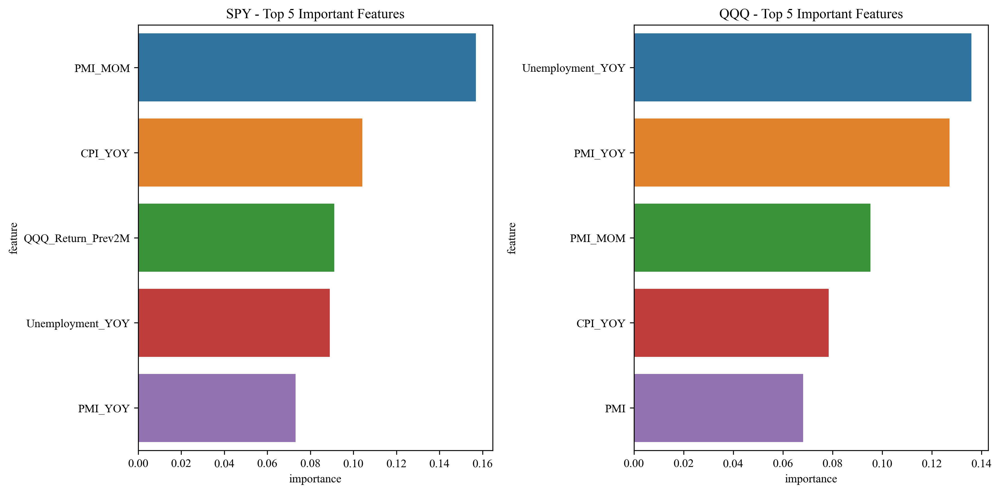

# Market Prediction Monthly Report - 2025-01

## Prediction Overview

This report presents machine learning model predictions for monthly percentage changes of:
- SPY (S&P 500 ETF): Jan 31, 2025 vs Dec 31, 2024
- QQQ (NASDAQ 100 ETF): Jan 31, 2025 vs Dec 31, 2024

The predictions are based on data available as of Dec 31, 2024, including:
- Latest economic indicators (Dec 2024): GDP, CPI, Unemployment, PMI
- Historical market returns (Oct-Dec 2024)

### Prediction Results

- **SPY Expected Return**: -0.86%
  - Confidence Interval: -2.44% to 0.67%
  
- **QQQ Expected Return**: 0.81%
  - Confidence Interval: -0.02% to 1.39%

## Prediction Methodology

We use a Random Forest Regression model with the following advantages:
1. Captures non-linear market relationships
2. Handles feature interactions automatically
3. Provides reliable uncertainty estimates
4. Reduces overfitting through ensemble learning

### Model Performance Metrics

- SPY Model R² Score: 0.7246
- QQQ Model R² Score: 0.7192

## Key Influencing Factors

### SPY Key Factors
|    | feature           |   importance |
|---:|:------------------|-------------:|
|  0 | PMI_MOM           |    0.156841  |
|  1 | CPI_YOY           |    0.10409   |
|  2 | QQQ_Return_Prev2M |    0.0911311 |
|  3 | Unemployment_YOY  |    0.0889988 |
|  4 | PMI_YOY           |    0.0730505 |

### QQQ Key Factors
|    | feature          |   importance |
|---:|:-----------------|-------------:|
|  0 | Unemployment_YOY |    0.135999  |
|  1 | PMI_YOY          |    0.127133  |
|  2 | PMI_MOM          |    0.0953055 |
|  3 | CPI_YOY          |    0.0784791 |
|  4 | PMI              |    0.068217  |

## Market Environment Analysis

Based on latest economic indicators:

- GDP: 23400.29
- CPI: 316.44
- Unemployment Rate: 4.20%
- PMI: 99.33

## Risk Disclaimer

1. Predictions are based on historical data and current market conditions
2. Confidence intervals represent the range of uncertainty
3. Use these predictions as one of many inputs for investment decisions

## Methodology Details

### Data Sources
- Economic Indicators: FRED (Federal Reserve Economic Data)
- Market Data: Yahoo Finance

### Feature Engineering
- Year-over-Year and Month-over-Month changes in economic indicators
- Seasonal factors (monthly and quarterly features)
- Historical market performance data

### Model Validation
- Cross-validation for performance evaluation
- Ensemble methods for prediction intervals
- Regular model updates to adapt to market changes

---
*This report is algorithmically generated for reference only. Investment involves risks.*
